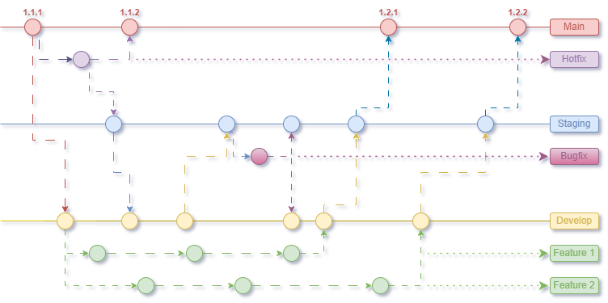
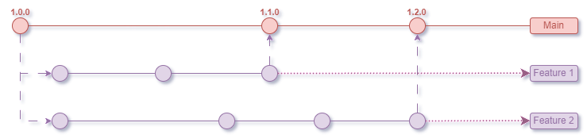
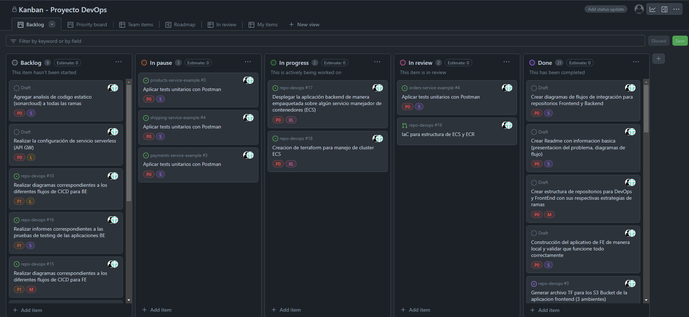

  

# Documento obligatorio-ORT-FI-69430-DevOps

**Integrantes:**

***Javier Bahar***

***Juan Mautone***

## Presentación del problema

Durante la transformación digital de una empresa líder en retail, surgió
un desafío que reveló una brecha significativa en la comunicación y
comprensión entre los equipos de desarrollo y operaciones. El
lanzamiento de una nueva aplicación, diseñada para mejorar la
experiencia de compra de los clientes, mostró errores recurrentes y
caídas del sistema, afectando la experiencia del usuario y la reputación
de la empresa. Este problema no era solo técnico, sino también cultural
y organizativo, ya que la separación entre el equipo de desarrollo,
enfocado en la rapidez y la innovación, y el equipo de operaciones,
centrado en la estabilidad, creó deficiencias en la responsabilidad
compartida y la comunicación efectiva.

## Propuesta

La dirección ejecutiva de la compañía intervino para abordar las causas
fundamentales del problema, reconociendo la necesidad de un cambio
cultural profundo. Se solicitó al equipo de proyecto un plan de acción
detallado que no solo aborde las ineficiencias operativas evidentes,
sino que también fomente un ambiente de colaboración, transparencia y
aprendizaje continuo. Este plan incluye estrategias específicas para
mejorar la comunicación y la colaboración entre los equipos de
desarrollo y operaciones, identificar y eliminar barreras que impidan la
eficacia de los flujos de trabajo integrados, y establecer prácticas que
promuevan una comprensión mutua de los desafíos y objetivos compartidos.

## Objetivos generales y específicos

El objetivo general de esta iniciativa es superar los obstáculos
actuales y establecer una base para la agilidad y resiliencia operativa
a largo plazo, asegurando así la competitividad de la empresa en el
mercado. Los objetivos específicos incluyen: mejorar la comunicación y
colaboración entre los equipos de desarrollo y operaciones, fomentar una
cultura de responsabilidad compartida, identificar y eliminar barreras
operativas, y promover una comprensión mutua de los desafíos y objetivos
comunes. A través de estos esfuerzos, se espera que la empresa no solo
resuelva los problemas actuales, sino que también mejore su capacidad
para adaptarse y prosperar en el futuro.

## Estrategia de ramas 
### Repositorios de Desarrollo (Gitflow)

  

En estos repositorios almacenamos todo lo relacionado al desarrollo de los microservicios, en nuestro caso tenemos 1 repositorio por microservicio de BE (4 en total) y 1 para el aplicativo de FE.

Para estos repositorios decidimos ir por la estrategia "GitFlow", ya que nos permite trabajar en ramas dedicadas para características o correciones en paralelo y podemos mantener multiples ambientes para testeo.
Mantenemos 3 ramas estables (Main, Staging, Develop) y ramas temporales en caso de que se desarrollen nuevas features o haya posibles bugfixes/hotfixes.

### Repositorio de DevOps (Trunk Based)

  

En este repositorio almacenamos todo lo relacionado a documentación relevante, infrastructura como codigo e imagenes relacionadas al CI/CD.

Para este repositorio decidimos adoptar el modelo "Trunk Based", debido a la naturaleza de la documentación que se encuentra en constante cambio y favorece la integración continua que trabajamos basandonos en una sola rama "Main". 
Manejamos "Feature branches" para las distintas partes agregadas de documentación e infrastructura como codigo.

## Proceso de CI/CD  

### Herramientas utilizadas

...
...

### Propuesta para microservicios BE

...
...

### Propuesta para aplicación FE

...
...

### Tablero Kanban

  

Para el manejo de tareas usamos el tablero "Kanban" que GitHub presta, este tiene el beneficio de ser trabajado con "Issues", los cuales pueden ser vinculados a nuevas ramas temporales. Al finalizar el trabajo en las mismas, se hace un pull request y se espera a la aprobación del otro, esto provoca que el estado del issue asociado a la rama cambie a finalizado.

## Etapas de CI para BE
### Analisis en SonarCloud 
...
...

### Analisis de codigo para microservicios 

...
...

## Testing de microservicios 

...
...

### Ejemplo de resultados correctos

...
...

### Ejemplo de resultados incorrectos

...
...

## Etapas de CD para BE
### Deploy ECS

...
...

### Servicio serverless - API Gateway

...
...

## Etapas de CI para FE
### Analisis en SonarCloud 
...
...

### Analisis de codigo para la aplicación frontend

...
...

## Etapas de CD para FE
### Deploy S3 BUCKETS

...
...
