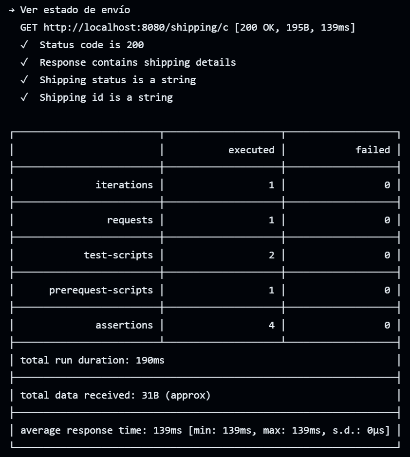

  

# Documento obligatorio-ORT-FI-69430-DevOps

**Integrantes:**

***Javier Bahar***

***Juan Mautone***

## Presentación del problema

Durante la transformación digital de una empresa líder en retail, surgió
un desafío que reveló una brecha significativa en la comunicación y
comprensión entre los equipos de desarrollo y operaciones. El
lanzamiento de una nueva aplicación, diseñada para mejorar la
experiencia de compra de los clientes, mostró errores recurrentes y
caídas del sistema, afectando la experiencia del usuario y la reputación
de la empresa. Este problema no era solo técnico, sino también cultural
y organizativo, ya que la separación entre el equipo de desarrollo,
enfocado en la rapidez y la innovación, y el equipo de operaciones,
centrado en la estabilidad, creó deficiencias en la responsabilidad
compartida y la comunicación efectiva.

## Propuesta

La dirección ejecutiva de la compañía intervino para abordar las causas
fundamentales del problema, reconociendo la necesidad de un cambio
cultural profundo. Se solicitó al equipo de proyecto un plan de acción
detallado que no solo aborde las ineficiencias operativas evidentes,
sino que también fomente un ambiente de colaboración, transparencia y
aprendizaje continuo. Este plan incluye estrategias específicas para
mejorar la comunicación y la colaboración entre los equipos de
desarrollo y operaciones, identificar y eliminar barreras que impidan la
eficacia de los flujos de trabajo integrados, y establecer prácticas que
promuevan una comprensión mutua de los desafíos y objetivos compartidos.

## Objetivos generales y específicos

El objetivo general de esta iniciativa es superar los obstáculos
actuales y establecer una base para la agilidad y resiliencia operativa
a largo plazo, asegurando así la competitividad de la empresa en el
mercado. Los objetivos específicos incluyen: mejorar la comunicación y
colaboración entre los equipos de desarrollo y operaciones, fomentar una
cultura de responsabilidad compartida, identificar y eliminar barreras
operativas, y promover una comprensión mutua de los desafíos y objetivos
comunes. A través de estos esfuerzos, se espera que la empresa no solo
resuelva los problemas actuales, sino que también mejore su capacidad
para adaptarse y prosperar en el futuro.

## Estrategia de ramas 
### Repositorios de Desarrollo (Gitflow)

  

En estos repositorios almacenamos todo lo relacionado al desarrollo de los microservicios, en nuestro caso tenemos 1 repositorio por microservicio de BE (4 en total) y 1 para el aplicativo de FE.

Para estos repositorios decidimos ir por la estrategia "GitFlow", ya que nos permite trabajar en ramas dedicadas para características o correciones en paralelo y podemos mantener multiples ambientes para testeo.
Mantenemos 3 ramas estables (Main, Staging, Develop) y ramas temporales en caso de que se desarrollen nuevas features o haya posibles bugfixes/hotfixes.

### Repositorio de DevOps (Trunk Based)

  

En este repositorio almacenamos todo lo relacionado a documentación relevante, infrastructura como codigo e imagenes relacionadas al CI/CD.

Para este repositorio decidimos adoptar el modelo "Trunk Based", debido a la naturaleza de la documentación que se encuentra en constante cambio y favorece la integración continua que trabajamos basandonos en una sola rama "Main". 
Manejamos "Feature branches" para las distintas partes agregadas de documentación e infrastructura como codigo.

## Tablero Kanban

  

Para el manejo de tareas usamos el tablero "Kanban" que GitHub presta, este tiene el beneficio de ser trabajado con "Issues", los cuales pueden ser vinculados a nuevas ramas temporales. Al finalizar el trabajo en las mismas, se hace un pull request y se espera a la aprobación del otro, esto provoca que el estado del issue asociado a la rama cambie a finalizado.

## Proceso de CI/CD  

### Herramientas utilizadas

A continuación damos una explicación breve de cada herramienta usada tanto para el aplicativo de FE como los microservicios de BE.

- GitHub: Para alojar y versionar nuestro código en la nube, facilitando la colaboración y el control de cambios en el desarrollo.
- GitHub Actions: Para automizar flujos de trabajo y para desencadenar la Pipeline de CI/CD empleada.
- SonarCloud: Para analizar posibles vulnerabilidades en el codigo de los aplicativos.
- Docker: Para la creación y mantenimiento de imágenes de los microservicios de backend.
- Maven: Para la gestión de dependencias y la automatización de procesos de building en los microservicios de backend que usan Java.
- Node: Para compilar el aplicativo de frontend en JavaScript.
- Postman: Para testear el funcionamiento de las APIs de los microservicios de backend.
- Newman: Para ejecutar colecciones de Postman desde la línea de comandos desde un workflow file.
- AWS Academy Learner Lab: Para el uso y mantenimiento de recursos que otorga AWS.
- Visual Studio Code: Para desarrollo de forma local y gestión de recursos de software necesarios. 
- Terraform: Para definir y programar la infrastructura como codigo utilizada.
- AWS CLI: Para gestionar nuestros servicios de AWS por línea de comandos.
- Elastic Container Repository (ECR): Para el almacenaje de imágenes Docker de los microservicios de backend.
- Elastic Container Service (ECS): Como orquestador de contenedores Docker, manejando el escalado y la disponibilidad de nuestras aplicaciones.
- S3 Buckets: Para el almacenamiento del código del aplicativo de frontend.

## IaC - Terraform 

Toda la infrastructura es desplegada como IaC en Terraform.
La misma está fragmentada por modulos y se diferencia su despliegue por workspaces.

(ver si meter alguna imagen y redireccion a la carpeta terraform para mostrar algo desde el readme raiz)

### Propuesta para microservicios BE

  

Explicar

### Propuesta para aplicación FE

  

Explicar

## Etapas de CI para BE
### Analisis en SonarCloud (BE) 

A continuación, se presentan los resultados obtenidos durante en análisis de código estático dentro de la rama main, de todos los repositorios que alojan los microservicios. 

> Aclaración: El análisis se realiza dentro de todas las ramas estables de los repositorios, es decir, en las ramas main, staging y develop. Pero a continuación mostraremos únicamente el analisis de la rama main.

#### Requisitos de calidad de código

Para el análisis de calidad de código utilizamos la configuracion que incluye SonarCloud por defecto, se trata de "Sonar Way". 

### Orders service

Para el microservicio "orders", el resultado fue "Failed". Esto quiere decir que no cumple con los requisitos de calidad definidos por SonarCloud. Cuando un análisis falla, puede ser que el código introducido tiene vulnerabilidades críticas de seguridad, malas prácticas de programación, código duplicado en exceso, falta de cobertura de pruebas, entre otros. 

  

  

### Payments service

Para el microservicio de "payments", el resultado pasó los estándares de cálidad.

  

  

### Products service

Para el microservicio de "products", el resultado pasó los estándares de cálidad.

  

  

### Shipping service

Para el microservicio de "shipping", el resultado pasó los estándares de cálidad.

  

  

## Testing de microservicios 

Para el testing de los microservicios se utilizaron pruebas de integración con Postman. El fin de estas pruebas es reducir la posibilidad de introducir errores al código, y que todo funcione como se espera. 

Las siguientes imágenes mostrarán ejemplos de como se visualiza un proceso correcto de testing para todos los microservicios.

### Ejemplo de resultados correctos

### Orders service 

  

### Payments service 

  

### Products service 

  

### Shipping service 

  

### Build del microservicio

Utilizando Maven.

## Etapas de CD para BE
### Push image ECR

...
...

### Deploy ECS

...
...

### Servicio serverless - API Gateway

...
...

## Etapas de CI para FE
### Analisis en SonarCloud (FE) 

Para la aplicación frontend nuevamente utilizamos SonarCloud para el análisis de código estático. Tambien se utilzó la configuración por defecto brindada por SonarCloud.

### Analisis de codigo para la aplicación frontend

Los resultados obtenidos son los siguientes:

  

  

### Build de la aplicación

Etapa de instalación de dependencias y posterior build de la aplicación. Antes de finalizar, se sube el compilado a un artifact de GitHub, el cual luego queda asociado al workflow y permite ser descargado para poder tener un control de las versiones.

A su vez, este artifact es utilzado para el proceso de deploy en el S3 Bucket.

Creación del artefacto en ejecución:

  

Como se visualiza el artefacto generado:

  

## Etapas de CD para FE
### Deploy S3 BUCKETS

La aplicación frontend, luego de las etapas de análisis de código estático e instalación de dependecias y build del aplicativo, es desplegada en un S3 Bucket. Cada rama estable tiene su propio ambiente y su propio S3 Bucket (3 en total, 1 para main, 1 para staging y otro para develop).

